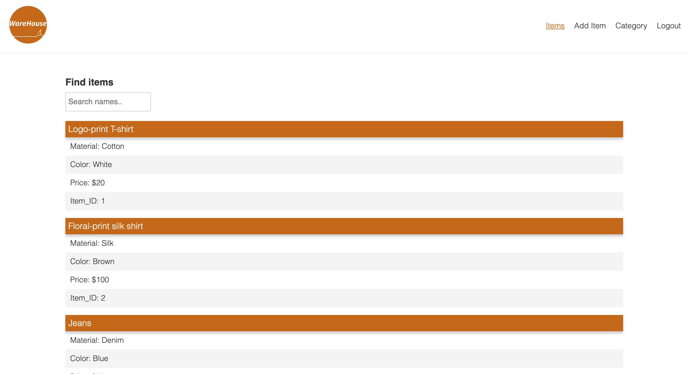
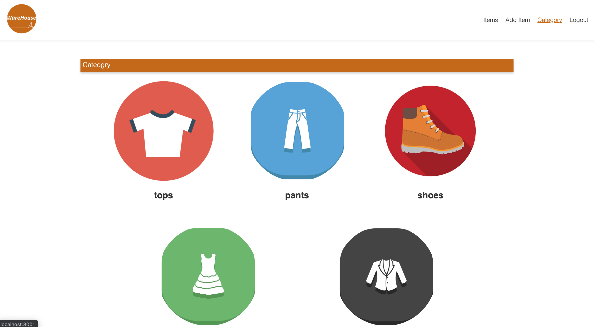

# WareHouse

### User story

AS an employee I want to be able to view, edit, and delete stock

WHEN I want to see if an item is in stock

Then I can search for it

WHEN I want to see details on an item

THEN I can see color, fabric and price

WHEN an item leaves the store

THEN I can update the database

WHEN an item arrives in the store

THEN I can add it to the database

## Design Decissions

All routes apart form the login and signup are behind an auth wall.
This was done so only the comapny who owns the items can view their invenotry.

## Installation Instructions

To install run "npm i"
then "node server.js"

## [Repository](https://github.com/GreenTeamm/WareHouse)

## Screenshots of Deployed Application

### 

### 

### 

### 

## Resources used:

### [Stack Overflow](https://stackoverflow.com/)

### [NPM Discussion](https://github.com/npm/feedback/discussions)

## Technologies

### [Node.js](https://nodejs.org/)

### [Heroku](https://www.heroku.com/)

### [NPM Express](https://www.npmjs.com/package/express)

### [Sequelize](https://sequelize.org/)

### [Routes](https://www.npmjs.com/package/routes)

### [Handlebars](https://handlebarsjs.com/)

### [Morgan](https://www.npmjs.com/package/morgan)

### [MySQL](https://www.mysql.com/)
